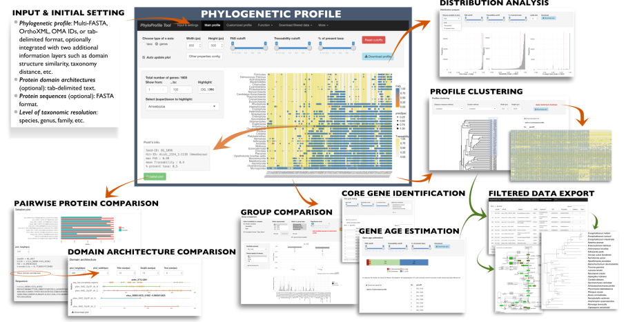

# PhyloProfile
[](https://www.r-project.org/)
[](https://f1000research.com/posters/6-1782)
[](https://github.com/BIONF/PhyloProfile/releases/tag/v0.1.0)
[](https://opensource.org/licenses/MIT)

[](https://f1000research.com/posters/6-1782)
[Click for the full PDF version of the poster](https://f1000research.com/posters/6-1782)

*PhyloProfile* is a *Shiny*-based tool for integrating, visualizing and exploring multi-layered phylogenetic profiles.

Alongside the presence/absence patterns of orthologs across large taxon collections, *PhyloProfile* allows the integration of any two additional information layers. These complementary data, like sequence similarity between orthologs, similarities in their domain architecture, or differences in functional annotations enable a more informed interpretation of phylogenetic profiles.

By utilizing the NCBI taxonomy, *PhyloProfile* can dynamically collapse taxa into higher systematic groups. This enables rapidly changing the resolution from the comparative analyses of proteins in individual species to that of entire kingdoms or even domains without changes to the input data.

*PhyloProfile* furthermore allows for a dynamic filtering of profiles – taking the taxonomic distribution and the additional information layers into account. This, along with functions to estimate the age of genes and core gene sets facilitates the exploration and analysis of large phylogenetic profiles.

[Explore the installation-free online version](https://phyloprofile.shinyapps.io/phyloprofile/) or [watch the demo video](https://vimeo.com/225373912) to learn more.

# Table of Contents
- [Installation & Usage](#installation--usage)
- [Input Data](#input-data)
  * [OrthoXML](#orthoxml)
    + [OMA Standalone](#oma-standalone)
    + [OMA Browser](#oma-browser)
  * [Your tool is missing?](#your-tool-is-missing)
  * [Demo data](#demo-data)
- [Bugs](#bugs)
- [Acknowledgements](#acknowledgements)
- [Contact](#contact)

# Installation & Usage
*PhyloProfile* is based on the *R*-package *Shiny*, as such a recent version of *R* is needed. Once that is out of the way you can just clone this repository to get a copy of *PhyloProfile*.

`git clone https://github.com/BIONF/phyloprofile`

To start PhyloProfile simply move into the PhyloProfile directory and run the main script

```
cd PhyloProfile
Rscript phyloprofile.R
```

The initial start can take a while, as `phyloprofile.R` will try do download and install all necessary dependencies automatically. *(Note: Depending on your system this sometimes fails, please check the console log for error messages concerning the dependency installation)*

Once all packages are downloaded and installed your web browser will open a new tab and display the main *PhyloProfile* menu.

# Input Data
*PhyloProfile* can read a number of different input files, including regular tab-separated files and *OrthoXML*. The additional information layers can be embedded in the OrthoXML or be provided separately.

## OrthoXML
*PhyloProfile* is capable of reading in files in the [*standardized OrthoXML format*](http://www.orthoxml.org/xml/Main.html), as e.g. generated by *Inparanoid* or [*OMA Standalone*](http://omabrowser.org/standalone/). *PhyloProfile* expects [the *NCBI taxonomy IDs*](https://www.ncbi.nlm.nih.gov/taxonomy) to be present in the `species` tag in the XML as `NCBITaxId` like this:

`<species name="Dipodomys ordii" NCBITaxId="10020">`

### OMA Standalone
By default, the output of [*OMA Standalone*](http://omabrowser.org/standalone/) does not include the correct `NCBITaxId` (c.f. `data/demo/oma_example.orthoxml`) but rather gives these as `<species name="Dipodomys_ordii" NCBITaxId="-1">`. With `scripts/convert_oma_standalone_orthoxml.py` we provide a basic Python script to enable the use of *OMA Standalone*.

Besides the *OrthoXML* of *OMA Standalone* it only requires a simple, tab-separated mapping-file that maps the species names as generated by *OMA Standalone* to the *NCBI Taxonomy ID*. *OMA Standalone* uses the filenames of the protein sets you put into the `DB` folder as the species names, with `Dipodomys_ordii.fa` being transformed into the species name `Dipodomys_ordii`. An example mapping file should look like this:
```
$ head -n 3 data/demo/taxon_mapping_oma_orthoxml.csv
Dipodomys_ordii	10020
Mus_musculus	10090
Rattus_norvegicus	10116
```

To convert the *OrthoXML* of *OMA Standalone* to a PhyloProfile compatible *OrthoXML* you can simply run

`./scripts/convert_oma_standalone_orthoxml.py -x data/demo/oma_example.orthoxml -m data/demo/taxon_mapping_oma_orthoxml.csv > data/demo/oma_example_phyloprofile_compatible.orthoxml`

### OMA Browser
If you prefer to use precalculated *Hierarchical Orthologous Groups* (HOGs) from the [*OMA Browser*](http://omabrowser.org/oma/home/) you can download your HOGs of interest right away from the commandline. To this end we provide `scripts/get_oma_hogs.py`. The input for this script is a list of *OMA* protein IDs (e.g. `RATNO03710`) or *Uniprot* IDs (e.g. `P53_HUMAN`). The types of IDs can be mixed.

Running

`./scripts/get_oma_hogs.py -i RATNO03709 RATNO03710 RATNO03711 P53_HUMAN`

will yield a single, merged *OrthoXML* files that contains the four *HOGs* for the corresponding proteins.

## Your tool is missing?
Please get in touch! we are trying to support more orthology prediction tools right out of the box.

## Demo data
In `data/demo/` you can find some test data to see how the files should look like. In our [Wiki you can find a walkthrough through the different files](https://github.com/BIONF/PhyloProfile/wiki/Input-Data) and how they relate to the different functions of *PhyloProfile*.

# Bugs
Any bug reports or comments, suggestions are highly appreciated. Please open an issue on GitHub or be in touch via email.

# Acknowledgements
We would like to thank
1) [Bastian](https://github.com/gedankenstuecke) for the great initial idea and his kind support,
2) Members of [Ebersberger group](http://www.bio.uni-frankfurt.de/43045195/ak-ebersberger) for many valuable suggestions and ...bug reports :)

# Code of Conduct & License
This tool is released with a [Contributor Code of Conduct](https://github.com/BIONF/PhyloProfile/blob/master/CODE_OF_CONDUCT.md) & under [MIT license](https://github.com/BIONF/PhyloProfile/blob/master/LICENSE).

# Contact
Vinh Tran
tran@bio.uni-frankfurt.de
