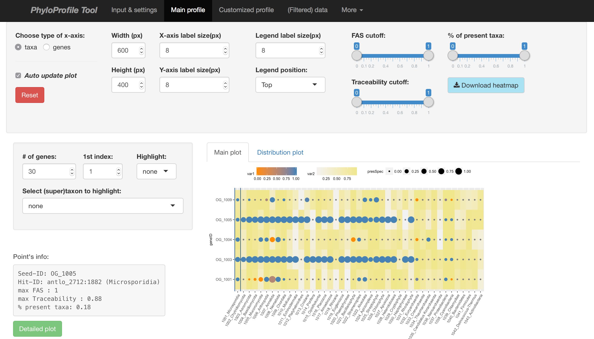
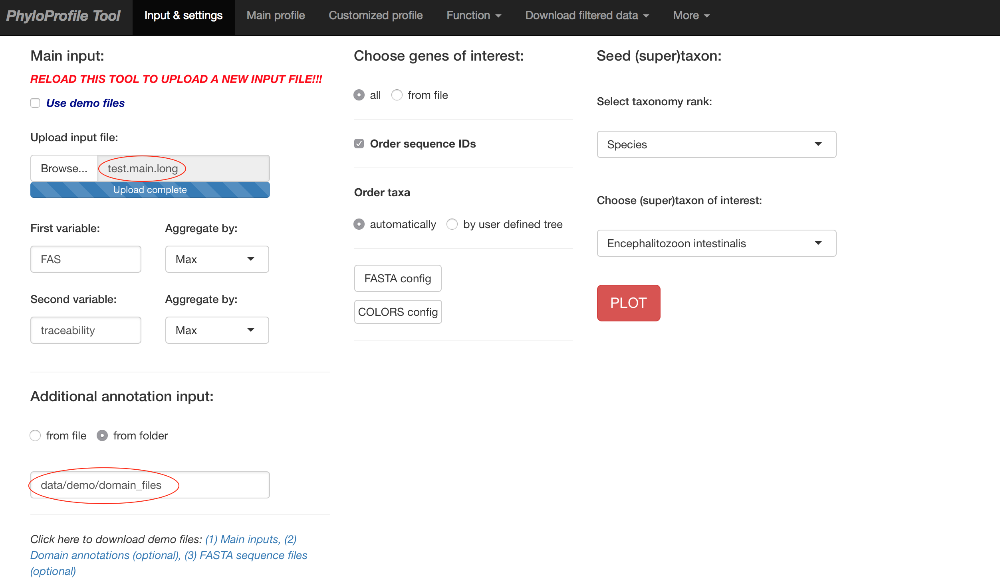
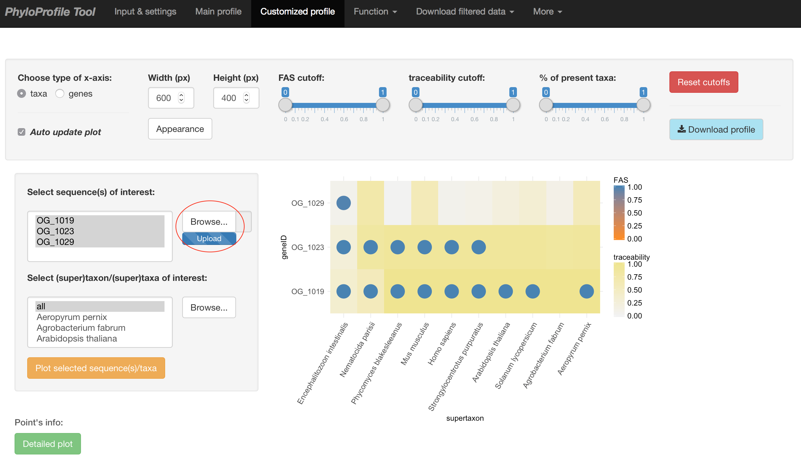
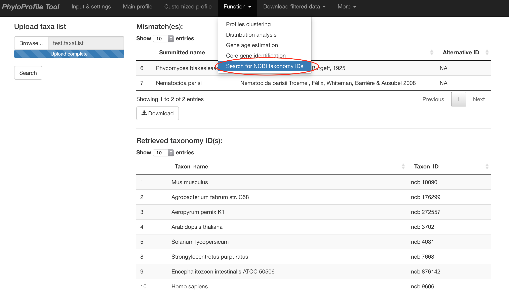

# PhyloProfile Tool

PhyloProfile is a Shiny(R)-based tool for integrating, visualizing and exploring multi- layered phylogenetic profiles

Alongside the presence/absence pattern of orthologs across large taxon collections, PhyloProfile allows the integration of any two additional information layers. These complementary data, e.g. sequence similarity between orthologs, similarities and differences of their domain architectures or their Gene Ontology-term-based semantic similarities, etc. will enable a more reliable functional inference among those orthologous sequences.

By utilizing the NCBI taxonomy, input taxa can be dynamically collapsed into higher order systematic groups. By that you can rapidly change the resolution from the comparative analyses of proteins in individual species to that of entire kingdoms or even domains without the need of input data modification.

Profiles can be filtered dynamically according to various criteria. For example, setting a minimal threshold for the fraction of species in a systematic group, or filtering collections of orthologs based on the pre-computed similarity of their domain architectures - if provided as an information layer.

# Demo data
[Click here to watch demo video](https://youtu.be/Udt316KoM6Y)

In `data/demo/` you can find some test data:
- `test.main`: Use this as the **Main input** file on the *Input & settings* page after starting *PhyloProfile*. It contains 3 information: `Ortholog ID # Feature architecture similarity score[1] # Traceability score[2]`.
- `test.main.long`: This is the same as `test.main` but in long format.
- `test.main.xml`: This is the same input file in OrthoXML format.
- `domains/*.txt`: This folder contains the feature architecture data (e.g. Pfam domains) that you can optionally give under the **Additional annotation input** upload on the *Input & settings* page after startup.

- `test.taxaList`: This contains list of taxon names. Use this to test the function of fetching NCBI taxonomy IDs, which can be found in *More* tab.

- `test.geneList`: After doing the initial plot with the files above you can use this file on the *Customized profile* tab to sub-select for only the genes present in this file.

# Usage
(1) Clone this git repository to your computer using this command:

>git clone https://github.com/trvinh/phyloprofile

OR

Manually download all the files to your computer and keep the original folder structure.

(2) Install dependent R packages:

>Rscript installPackages.R

(3) Run PhyloProfile tool:

>R -e 'shiny::runApp(,launch.browser=TRUE)'

(or open and run server.R / ui.R using RStudio)

NOTE: R and Rscript has to be installed on your machine.
NOTE2: please check if all packages are successfully installed, otherwise some features maybe unavailable or the tool cannot work correctly.

# Bugs
Any bug reports or comments, suggestions are highly appreciated.

# Acknowledgement
I would like to thank
1) [Bastian](https://github.com/gedankenstuecke) for the great initial idea and his kind support,
2) Members of [Ebersberger group](http://www.bio.uni-frankfurt.de/43045195/ak-ebersberger) for many valuable suggestions and ...bug reports :)

# Contact
Vinh Tran
tran@bio.uni-frankfurt.de
