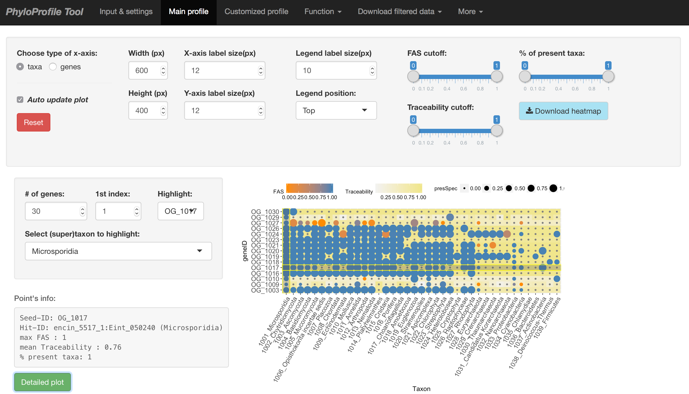

# PhyloProfile Tool



PhyloProfile is a Shiny(R)-based tool for integrating, visualizing and exploring multi- layered phylogenetic profiles

Alongside the presence/absence pattern of orthologs across large taxon collections, PhyloProfile allows the integration of any two additional information layers. These complementary data, e.g. sequence similarity between orthologs, similarities and differences of their domain architectures or their Gene Ontology-term-based semantic similarities, etc. will enable a more reliable functional inference among those orthologous sequences.

By utilizing the NCBI taxonomy, input taxa can be dynamically collapsed into higher order systematic groups. By that you can rapidly change the resolution from the comparative analyses of proteins in individual species to that of entire kingdoms or even domains without the need of input data modification.

Profiles can be filtered dynamically according to various criteria. For example, setting a minimal threshold for the fraction of species in a systematic group, or filtering collections of orthologs based on the pre-computed similarity of their domain architectures - if provided as an information layer.


# Demo data
[Click here to watch demo video](https://vimeo.com/225373912)

In `data/demo/` you can find some test data:
- `test.main`: Use this as the **Main input** file on the *Input & settings* page after starting *PhyloProfile*. It contains 3 information: `Ortholog ID # Feature architecture similarity score[1] # Traceability score[2]`.
- `test.main.long`: This is the same as `test.main` but in long format.
- `test.main.xml`: This is the same input file in OrthoXML format.
- `domains/*.txt`: This folder contains the feature architecture data (e.g. Pfam domains) that you can optionally give under the **Additional annotation input** upload on the *Input & settings* page after startup.

- `test.geneList`: After doing the initial plot with the files above you can use this file on the *Customized profile* tab to sub-select for only the genes present in this file.

- `test.taxaList`: This contains list of taxon names. Use this to test the function of fetching NCBI taxonomy IDs, which can be found in *Function* tab.


# Usage
(1) Clone this git repository to your computer using this command:

>git clone https://github.com/trvinh/phyloprofile

OR

Manually download all the files to your computer and keep the original folder structure.

(2) Install dependent R packages and run PhyloProfile:

>Rscript phyloprofile.R

NOTE: R and Rscript has to be installed on your machine.
NOTE 2: please check if all packages are successfully installed, otherwise some features maybe unavailable or the tool cannot work correctly.

# Input Data

## OrthoXML
*PhyloProfile* is capable of reading in files in the [*standardized OrthoXML format*](http://www.orthoxml.org/xml/Main.html), as e.g. generated by *Inparanoid* or [*OMA Standalone*](http://omabrowser.org/standalone/). *PhyloProfile* expects [the *NCBI taxonomy IDs*](https://www.ncbi.nlm.nih.gov/taxonomy) to be present in the `species` tag in the XML as `NCBITaxId` like this:

`<species name="Dipodomys ordii" NCBITaxId="10020">`

### OMA Standalone
By default, the output of [*OMA Standalone*](http://omabrowser.org/standalone/) does not include the correct `NCBITaxId` (c.f. `data/demo/oma_example.orthoxml`) but rather gives these as `<species name="Dipodomys_ordii" NCBITaxId="-1">`. With `scripts/convert_oma_standalone_orthoxml.py` we provide a basic Python script to enable the use of *OMA Standalone*.

Besides the *OrthoXML* of *OMA Standalone* it only requires a simple, tab-separated mapping-file that maps the species names as generated by *OMA Standalone* to the *NCBI Taxonomy ID*. *OMA Standalone* uses the filenames of the protein sets you put into the `DB` folder as the species names, with `Dipodomys_ordii.fa` being transformed into the species name `Dipodomys_ordii`. An example mapping file should look like this:
```
$ head -n 3 data/demo/taxon_mapping_oma_orthoxml.csv
Dipodomys_ordii	10020
Mus_musculus	10090
Rattus_norvegicus	10116
```

To convert the *OrthoXML* of *OMA Standalone* to a PhyloProfile compatible *OrthoXML* you can simply run

`./scripts/convert_oma_standalone_orthoxml.py -x data/demo/oma_example.orthoxml -m data/demo/taxon_mapping_oma_orthoxml.csv > data/demo/oma_example_phyloprofile_compatible.orthoxml`

### OMA Browser
If you prefer to use precalculated *Hierarchical Orthologous Groups* (HOGs) from the [*OMA Browser*](http://omabrowser.org/oma/home/) you can download your HOGs of interest right away from the commandline. To this end we provide `scripts/get_oma_hogs.py`. The input for this script is a list of *OMA* protein IDs (e.g. `RATNO03710`) or *Uniprot* IDs (e.g. `P53_HUMAN`). The types of IDs can be mixed.

Running

`scripts/get_oma_hogs.py -i ./scripts/get_oma_hogs.py -i RATNO03709 RATNO03710 RATNO03711 P53_HUMAN`

will yield a single, merged *OrthoXML* files that contains the four *HOGs* for the corresponding proteins. 

### Your tool is missing?
Please get in touch! we are trying to support more orthology prediction tools right out of the box.

# Bugs
Any bug reports or comments, suggestions are highly appreciated.

# Acknowledgements
I would like to thank
1) [Bastian](https://github.com/gedankenstuecke) for the great initial idea and his kind support,
2) Members of [Ebersberger group](http://www.bio.uni-frankfurt.de/43045195/ak-ebersberger) for many valuable suggestions and ...bug reports :)

# Contact
Vinh Tran
tran@bio.uni-frankfurt.de
