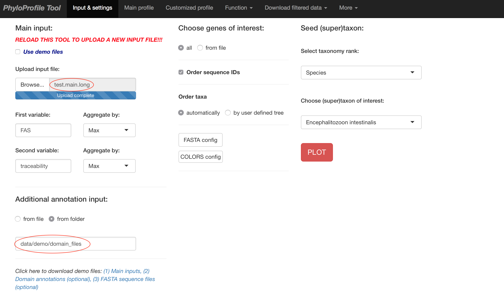

# Demo data
[Click here to watch demo video](https://youtu.be/Udt316KoM6Y)

In `data/demo/` you can find some test data:
- `test.main`: Use this as the **Main input** file on the *Input & settings* page after starting *PhyloProfile*. It contains 3 information: `Ortholog ID # Feature architecture similarity score[1] # Traceability score[2]`.
- `test.main.long`: This is the same as `test.main` but in long format.
- `test.main.xml`: This is the same input file in OrthoXML format.
- `domains/*.txt`: This folder contains the feature architecture data (e.g. Pfam domains) that you can optionally give under the **Additional annotation input** upload on the *Input & settings* page after startup.

- `test.geneList`: After doing the initial plot with the files above you can use this file on the *Customized profile* tab to sub-select for only the genes present in this file.

- `test.taxaList`: This contains list of taxon names. Use this to test the function of fetching NCBI taxonomy IDs, which can be found in *Function* tab.

