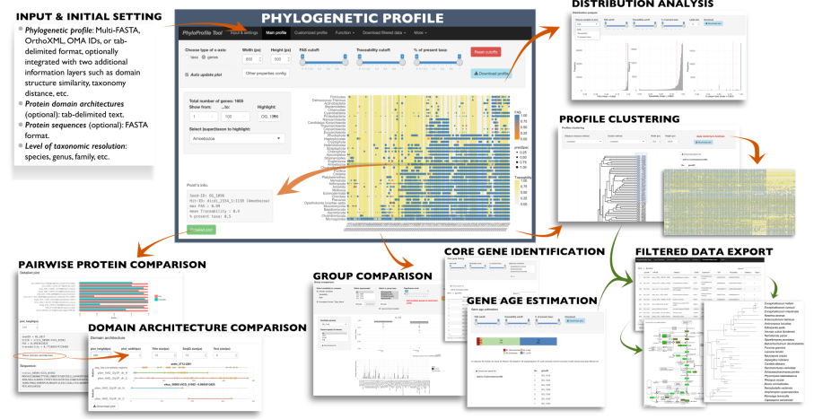

```{r setup, include = FALSE}
knitr::opts_chunk$set(
    library(PhyloProfile),
    collapse = TRUE,
    comment = "#>"
)
```

# Introduction
Phylogenetic profiles capture the presence - absence pattern of genes across
species (Pellegrini et al., 1999). The presence of an ortholog in a given
species is often taken as evidence that also the corresponding function is
represented (Lee et al., 2007). Moreover, if two genes agree in their
phylogenetic profile, it can suggest that they functionally interact
(Pellegrini et al., 1999). Phylogenetic profiles are therefore commonly used
for tracing functional protein clusters or metabolic networks across species
and through time. However, orthology inference is not error-free (Altenhoff
et al., 2016), and orthology does not guarantee functional equivalence for
two genes (Studer and Robinson-Rechavi, 2009). Therefore, phylogenetic
profiles are often integrated with accessory information layers, such as
sequence similarity, domain architecture similarity, or semantic similarity
of Gene Ontology-term descriptions.

Various approaches exist to visualize such profiles. However, there is still a
shortage of tools that provide a comprehensive set of functions for the display,
filtering and analysis of multi-layered phylogenetic profiles comprising
hundreds of genes and taxa. To close this methodological gap, we present here
**PhyloProfile**, an *R-based tool to visualize, explore and analyze
multi-layered phylogenetic profiles*.

# How to install PhyloProfile

To install the PhyloProfile package via [Bioconductor](https://bioconductor.org)
using BiocManager:

```r
if (!requireNamespace("BiocManager"))
    install.packages("BiocManager")
BiocManager::install("PhyloProfile")
```

To install the dev version from [github](https://github.com/BIONF/PhyloProfile):

```r
if (!requireNamespace("devtools"))
    install.packages("devtools", repos = "http://cran.us.r-project.org")
devtools::install_github(
    "BIONF/PhyloProfile",
    INSTALL_opts = c('--no-lock'),
    build_opts = c('--no-resave-data')
)
```

Or use directly the online version at
http://applbio.biologie.uni-frankfurt.de/phyloprofile/.

# Input
PhyloProfile expects as a main input the phylogenetic distribution of orthologs,
or more generally of homologs. This information can be complemented with domain
architecture annotation and data for up to two additional annotation layers.

Beside tab delimited text and sequences in FASTA format, the tool also accepts
orthoXML (Schmitt et al., 2011), or a list of OMA IDs (Altenhoff et al., 2015)
as input.

Here is an example of a tab delimited input with two additional annotation
layers:
```{r, echo = FALSE, results = 'asis'}
data("mainLongRaw", package="PhyloProfile")
knitr::kable(head(mainLongRaw, 10))
```

*The [WIKI](https://github.com/BIONF/PhyloProfile/wiki/Input-Data) accompanying
PhyloProfile gives a comprehensive guide of how to format input data.*

# Features and capabilities
## Interactive visualization and dynamic exploration of phylogenetic profiles
Together with several functions for exploring phylogenetic profiles, we provide
an interactive visualization application implemented with
[Shiny](https://shiny.rstudio.com) (https://CRAN.R-project.org/package=shiny).

```{r pressure, echo=FALSE, fig.cap="PhyloProfile's GUI", out.width = '100%'}

```

For both command-based and visualization analyses, users can:

- dynamically **change the resolution of the analysis** from invidual species
to phyla or entire kingdoms by collapsing the input taxa into higher systematic
rank. Species are automatically linked to the NCBI taxonomy, and are ordered
in increasing taxonomic distance from a user-specified reference taxon.
*PhyloProfile is able to represent co-orthologs (in-paralogs), if the working
taxonomic rank is the deepest one (e.g. strain or species) that can be
found in the input taxa.*
- dynamically **filter data** by applying different thresholds to the integrated
information (e.g. increasing the fraction of species in a systematic group that
must harbor an ortholog before the gene is considered present in this group
reduces the impact of spurious ortholog identification on evolutionary
interpretations).
- dynamically **modify the apperance of profile** with diverse plot
configuration options.

PhyloProfile is able to represent the entire data matrix (`Main profile`) or to
visualize only a subset of genes and taxa for a detailed inspection
(`Customized profile`), without the need of modifying the input data.

Besides, PhyloProfile's interface will be automatically varied according to
user's input files, such as the names of two additional information layers or
list of input taxa.

## Analysis functions
PhyloProfile provides several functions for dynamically analyzing phylogenetic
profiles.

### Profile clustering
The identification of proteins with similar phylogenetic profiles is a crucial
step in the identification and characterization of novel functional protein
interaction networks (Pellegrini, 2012). PhyloProfile offers the option to
cluster genes according to the distance of their phylogenetic profiles.

```{r, fig.show='hold', dev='CairoPNG'}
### An example for plotting the clustered profiles tree.
### See ?getDendrogram for more details.

#' Load built-in data
data("fullProcessedProfileLarge", package="PhyloProfile")
data <- fullProcessedProfileLarge

#' Calculate distance matrix
#' Check ?getDistanceMatrix
profileType <- "binary"
profiles <- getDataClustering(
    data, profileType, var1AggregateBy, var2AggregateBy)
method <- "mutualInformation"
distanceMatrix <- getDistanceMatrix(profiles, method)

#' Create clustered profile tree
clusterMethod <- "complete"
dd <- clusterDataDend(distanceMatrix, clusterMethod)
getDendrogram(dd)
```

### Gene age estimation
PhyloProfile can estimate the evolutionary age of a gene from the phylogenetic
profiles using an LCA algorithm (Capra et al., 2013). Specifically, the last
common ancestor of the two most distantly related species displaying a given
gene serves as the minimal gene age. Age estimates are dynamically updated
upon filtering of the data.

```{r}
### An example for calculating gene age for the built-in data set.
### See ?estimateGeneAge for more details.

#' Load built-in data
data("fullProcessedProfile", package="PhyloProfile")

#' Choose the working rank and the reference taxon
rankName <- "class"
refTaxon <- "Mammalia"

#' Set cutoff for 2 additional variables and the percentage of present species
#' in each supertaxon
var1Cutoff <- c(0,1)
var2Cutoff <- c(0,1)
percentCutoff <- c(0,1)

#' Estimate gene age
estimateGeneAge(
    fullProcessedProfile, rankName, refTaxon,
    var1Cutoff, var2Cutoff, percentCutoff
)
```

### Core gene identification
Phylogenomic reconstructions are typically based on a collection of core genes
(Daubin et al., 2002), i.e. genes that are shared among all genomes in a taxon
collection. PhyloProfile enables users to select a set of taxa and returns
their core genes.

```{r}
### An example for calculating core gene set for the built-in data set.
### See ?getCoreGene for more details.

#' Load built-in data
data("fullProcessedProfile", package="PhyloProfile")
processedProfileData <- fullProcessedProfile

#' Choose the working rank and a set of taxa of interest
rankName <- "class"
taxaCore <- c("Mammalia", "Mucorales", "Alphaproteobacteria")

#' Set cutoff for 2 additional variables and the percentage of present species
#' in each supertaxon
var1Cutoff <- c(0.75, 1.0)
var2Cutoff <- c(0.75, 1.0)
percentCutoff <- c(0.0, 1.0)

#' Set core coverage, the % of taxa that must be present in the selected set
coreCoverage <- 1

#' Identify core genes
getCoreGene(
    rankName,
    taxaCore,
    processedProfileData,
    var1Cutoff, var2Cutoff,
    percentCutoff, coreCoverage
)
```

### Group comparison
This function is used to compare the distribution of the additional variables
between two taxon groups, an in- and an out-group. Users can define the in-group
and all taxa not included in this are used as the out-group. The value
distributions of the variables are then compared using statistical tests
(Kolmogorov-Smirnov and Wilcoxon-Mann-Whitney) using the specified significant
level (*0.05 by default*). Genes that have a significantly different
distribution will be shown in the candidate gene list for further analysis.

```{r}
#' Load built-in data
data("mainLongRaw", package="PhyloProfile")
data <- mainLongRaw
#' choose the in-group taxa
inGroup <- c("ncbi876142", "ncbi586133")
#' choose variable to be compared
variable <- colnames(data)[4]
#' compare the selected variable between the in-group and out-group taxa
compareTaxonGroups(data, inGroup, TRUE, variable, 0.05)
```

### Distribution analysis
The interpretation of phylogenetic profiles, and the result of downstream
analyses can change substantially upon filtering the data. To help users to
decide on reasonable filtering thresholds, PhyloProfile provides a function to
plot the distributions of the values incurred by the integrated information
layers.

```{r, fig.show='hold', dev='CairoPNG'}
### An example for plotting the distribution of the 1st additional variable.
### See ?createVarDistPlot for more details.

#' Load built-in data
data("mainLongRaw", package="PhyloProfile")

#' Process data for distribution analysis
#' See ?createVariableDistributionData
data <- createVariableDistributionData(
    mainLongRaw, c(0, 1), c(0.5, 1)
)
head(data, 6)

#' Choose a variable for plotting and set the variable name
varType <- "var1"
varName <- "Variable 1"

#' Set cutoff for the percentage of present species in each supertaxon
percentCutoff <- c(0,1)

#' Set text size
distTextSize <- 12

#' Create distribution plot
createVarDistPlot(
    data,
    varName,
    varType,
    percentCutoff,
    distTextSize
)
```

# Examples
## Process raw input
Process raw input (in different format) into a dataframe that contains all
required information for the phylogenetic profile analysis.

```{r}
#' Load built-in data
#' If input data is in other format (e.g. fasta, OrthoXML, or wide matrix),
#' see ?createLongMatrix
rawInput <- system.file(
    "extdata", "test.main.long", package = "PhyloProfile", mustWork = TRUE
)

#' Set working rank and the reference taxon
rankName <- "class"
refTaxon <- "Mammalia"

#' Input a user-defined taxonomy tree to replace NCBI taxonomy tree (optional)
taxaTree <- NULL

#' Choose how to aggregate the additional variables when pocessing the data
#' into supertaxon
var1AggregateBy <- "max"
var2AggregateBy <- "mean"

#' Set cutoffs for for percentage of species present in a supertaxon,
#' allowed number of co orthologs, and cutoffs for the additional variables
percentCutoff <- c(0.0, 1.0)
coorthologCutoffMax <- 10
var1Cutoff <- c(0.75, 1.0)
var2Cutoff <- c(0.5, 1.0)

#' Choose the relationship of the additional variables, if they are related to
#' the orthologous proteins or to the species
var1Relation <- "protein"
var2Relation <- "species"

#' Identify categories for input genes (by a mapping tab-delimited file)
groupByCat <- FALSE
catDt <- NULL

#' Process the input file into a phylogenetic profile data that contains
#' taxonomy information and the aggregated values for the 2 additional variables
profileData <- fromInputToProfile(
    rawInput,
    rankName,
    refTaxon,
    taxaTree,
    var1AggregateBy,
    var2AggregateBy,
    percentCutoff,
    coorthologCutoffMax,
    var1Cutoff,
    var2Cutoff,
    var1Relation,
    var2Relation,
    groupByCat,
    catDt
)

head(profileData)
```

## Create profile plot
Generate phylogenetic profile heatmap after processing the raw input file.
```{r, fig.show='hold', dev='CairoPNG'}
#' Load built-in processed data
data("fullProcessedProfile", package="PhyloProfile")

#' Create data for plotting
plotDf <- dataMainPlot(fullProcessedProfile)

#' You can also choose a subset of genes and/or taxa for plotting with:
#' selectedTaxa <- c("Mammalia", "Echinoidea", "Gunneridae")
#' selectedSeq <- "all"
#' plotDf <- dataCustomizedPlot(
#'     fullProcessedProfile, selectedTaxa, selectedSeq
#' )

#' Identify plot's parameters
plotParameter <- list(
    "xAxis" = "taxa",
    "var1ID" = "FAS",
    "var2ID"  = "Traceability",
    "lowColorVar1" =  "#FF8C00",
    "highColorVar1" = "#4682B4",
    "lowColorVar2" = "#FFFFFF",
    "highColorVar2" = "#F0E68C",
    "paraColor" = "#07D000",
    "xSize" = 8,
    "ySize" = 8,
    "legendSize" = 8,
    "mainLegend" = "top",
    "dotZoom" = 0,
    "xAngle" = 60,
    "guideline" = 0,
    "colorByGroup" = FALSE
)

#' Generate profile plot
heatmapPlotting(plotDf, plotParameter)

#' To highlight a gene and/or taxon of interest
taxonHighlight <- "Mammalia"
rankName <- "class"
geneHighlight <- "OG_1019"
#' Then use ?highlightProfilePlot function
# highlightProfilePlot(
#    plotDf, plotParameter, taxonHighlight, rankName, geneHighlight
# )
```

## Create protein domain architecture plot
Generate the domain architecture plot for a gene of interest and its orthologs.
```{r, fig.show='hold', dev='CairoPNG'}
#' Load protein domain architecture file
domainFile <- system.file(
    "extdata", "domainFiles/OG_1009.domains",
    package = "PhyloProfile", mustWork = TRUE
)

#' Identify IDs of gene of interest and its ortholog partner
seedID <- "OG_1009"
orthoID <- "A.thaliana@3702@241736"
info <- c(seedID, orthoID)

#' Get data for 2 selected genes from input file
domainDf <- parseDomainInput(seedID, domainFile, "file")

#' Generate plot
plot <- createArchiPlot(info, domainDf, 9, 9)
grid::grid.draw(plot)
```

## Other use cases

**Get taxonomy IDs and names in a specified rank for taxa in the input file.**
```{r}
#' Load raw input
data("mainLongRaw", package="PhyloProfile")
inputDf <- mainLongRaw

#' Set working rank and the reference taxon
rankName <- "phylum"

#' Get taxonomy IDs and names for the input data
inputTaxonID <- getInputTaxaID(inputDf)
inputTaxonName <- getInputTaxaName(rankName, inputTaxonID)

head(inputTaxonName)
```

**Get taxonomy info for list of input taxa and sort it based on the taxonomy**
**distance to a reference taxon**
```{r}
#' Get list of taxon IDs and names for input profile
data("mainLongRaw", package="PhyloProfile")
inputDf <- mainLongRaw
rankName <- "phylum"
inputTaxonID <- getInputTaxaID(inputDf)

#' Input a user-defined taxonomy tree to replace NCBI taxonomy tree (optional)
inputTaxaTree <- NULL

#' Sort taxonomy list based on a selected refTaxon
refTaxon <- "Microsporidia"
sortedTaxonomy <- sortInputTaxa(
    taxonIDs = inputTaxonID,
    rankName = rankName,
    refTaxon = refTaxon,
    taxaTree = inputTaxaTree
)

sortedTaxonomy[, c("ncbiID", "fullName", "supertaxon", "supertaxonID", "rank")]
```

**More examples? Please tell us what you want to see ;-)**

# How to cite
>Ngoc-Vinh Tran, Bastian Greshake Tzovaras, Ingo Ebersberger; PhyloProfile:
Dynamic visualization and exploration of multi-layered phylogenetic profiles,
Bioinformatics, , bty225, https://doi.org/10.1093/bioinformatics/bty225

Or use the citation function in R CMD to have the citation in BibTex or
LaTeX format

```{r}
citation("PhyloProfile")
```

# How to contribute


Thanks so much for your interest in contributing to *PhyloProfile* 🎉👍🍾

Contributions to *PhyloProfile* can take many forms. If you are

**biologist**, you can

- [report bugs](https://github.com/BIONF/PhyloProfile/issues/new) for both
online & standalone version,
- [tell us about what features you would love to see](https://goo.gl/SBU4EG),
- improve our documentation, both
[in the Wiki](https://github.com/BIONF/PhyloProfile/wiki) and in our [R
ADME](https://github.com/BIONF/PhyloProfile/blob/master/README.md),
- discuss about [non-coding issues](https://goo.gl/bDS9Cb)

**biologist and love coding**, you can

- [fix existing bugs](https://github.com/BIONF/PhyloProfile/issues/),
- or add new features. Some things we'd love to see are: add scripts to add
out-of-the-box support for further orthology prediction tools, increasing the
test coverage from 0% to something above that, or basically whatever great
idea you have!
- and all points for non-coding contributors as well :)

**not biologist but can code**, it would be great if you can

- test the tool in different environments (Windows, Linux, Mac - Firefox,
Chrome, IE, Safari,...),
- suggest a better user interface,
- improve the code quality

Don't hesitate to get in touch with us if you have any questions. You can
contact us at [tran@bio.uni-frankfurt.de](mailto:tran@bio.uni-frankfurt.de)

## Contributors {.unnumbered}
- [Vinh Tran](https://github.com/trvinh)
- [Bastian Greshake Tzovaras](https://github.com/gedankenstuecke)
- [Carla Moelbert](https://github.com/CarlaMoelbert)

# SessionInfo()

Here is the output of `sessionInfo()` on the system on which this document was
compiles:

```{r sessionInfo, echo = FALSE}
sessionInfo(package = "PhyloProfile")
```

# References

1. Adebali, O. and Zhulin, I.B. (2017) Aquerium: A web application for
comparative exploration of domain-based protein occurrences on the taxonomically
clustered genome tree. Proteins, 85, 72-77.

2. Altenhoff, A.M. et al. (2016) Standardized benchmarking in the quest for
orthologs. Nat Methods, 13, 425-430.

3. Altenhoff, A.M. et al. (2015) The OMA orthology database in 2015: function
predictions, better plant support, synteny view and other improvements.
Nucleic Acids Res, 43, D240-249.

4. Capra, J.A. et al. (2013) How old is my gene? Trends Genet, 29, 659-668.
Daubin, V., Gouy, M. and Perriere, G. (2002) A phylogenomic approach to
bacterial phylogeny: evidence of a core of genes sharing a common history.
Genome Res, 12, 1080-1090.

5. Huerta-Cepas, J., Serra, F. and Bork, P. (2016) ETE 3: Reconstruction,
Analysis, and Visualization of Phylogenomic Data. Mol Biol Evol, 33, 1635-1638.

6. Koestler, T., Haeseler, A.v. and Ebersberger, I. (2010) FACT: Functional
annotation transfer between proteins with similar feature architectures.
BMC Bioinformatics, 11, 417.

7. Lee, D., Redfern, O. and Orengo, C. (2007) Predicting protein function
from sequence and structure. Nat Rev Mol Cell Biol, 8, 995-1005.

8. Moore, A.D. et al. (2014) DoMosaics: software for domain arrangement
visualization and domain-centric analysis of proteins. Bioinformatics,
30, 282-283.

9. Pellegrini, M. (2012) Using phylogenetic profiles to predict functional
relationships. Methods Mol Biol, 804, 167-177.

10. Pellegrini, M. et al. (1999) Assigning protein functions by comparative
genome analysis: protein phylogenetic profiles. Proc Natl Acad Sci U S A, 96,
4285-4288.

11. Schmitt, T. et al. (2011) Letter to the editor: SeqXML and OrthoXML:
standards for sequence and orthology information. Brief. Bioinform., 12,
485-488.

12. Studer, R.A. and Robinson-Rechavi, M. (2009) How confident can we be that
orthologs are similar, but paralogs differ? Trends Genet, 25, 210-216.
